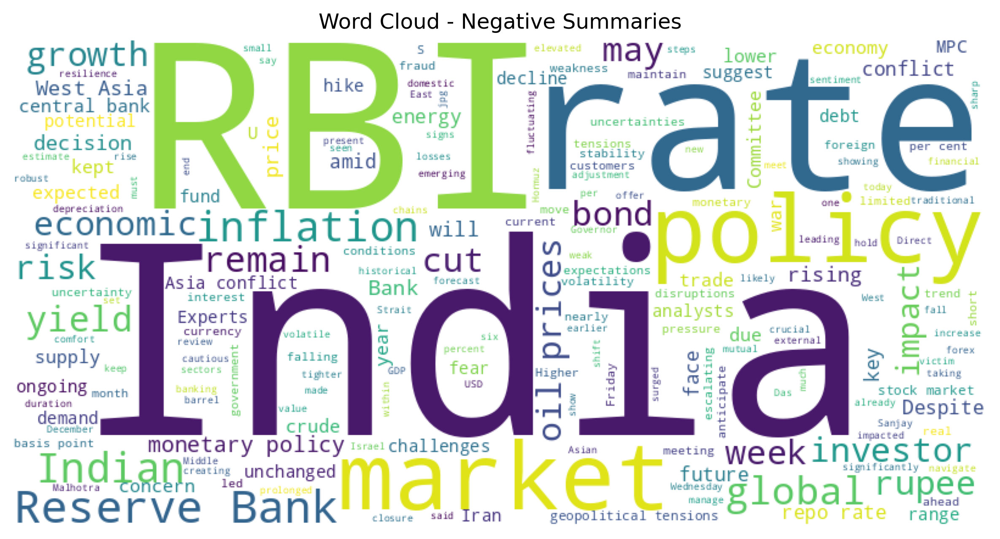
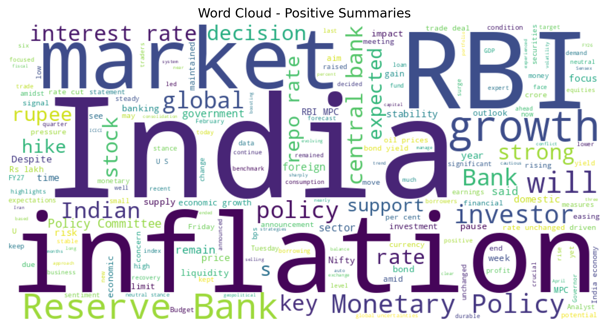

# Macro-Economic Policy Sentiment & Sovereign Risk Engine                     


# Sovereign Risk & Macro-Policy Sentiment Engine

Translating unstructured central bank rhetoric into quantitative risk indicators to predict market volatility.

---

## 📌 Table of Contents

- [Overview](#overview)  
- [Business Problem](#business-problem)  
- [Dataset](#dataset)  
- [Tools & Technologies](#tools--technologies)  
- [Project Structure](#project-structure)  
- [Data Extraction & Preparation](#data-extraction--preparation)  
- [Exploratory Data Analysis (EDA)](#exploratory-data-analysis-eda)  
- [Research Questions & Key Findings](#research-questions--key-findings)  
- [How to Run This Project](#how-to-run-this-project)  
- [Future Enhancements](#future-enhancements)  
- [Author & Contact](#author--contact)  

---

## Overview

In macroeconomics and quantitative risk, central bank communication is one of the strongest lead indicators of market movement. However, this communication is entirely unstructured text. Waiting for an official interest rate hike to adjust a portfolio is often too late—the market has usually already priced it in.

In this project, I engineered a natural language processing (NLP) pipeline to extract, quantify, and analyze sentiment from Reserve Bank of India (RBI) policy documents and financial news. Instead of just treating this as a basic text-classification exercise, I optimized the pipeline for **Sovereign Risk Analysis**—correlating quantitative "Hawkish" or "Dovish" signals with simulated market volatility.

---

## Business Problem

Financial institutions, asset managers, and corporate treasuries face constant exposure to interest rate volatility and macroeconomic shocks. Sudden shifts in central bank policy can trigger massive fluctuations in bond yields, exchange rates (USD/INR), and equity indices. 

**This project aims to:**

- Automate the extraction of central bank policy news and meeting minutes to remove human bias in reading.
- Translate qualitative, bureaucratic text into a structured, numerical sentiment score (Compound VADER score).
- Identify "Tail-Risk" events by mapping extreme negative sentiment spikes to periods of high market volatility.
- Provide a data-driven framework that risk teams can use to dynamically adjust capital reserves or hedge positions ahead of officially announced policy shifts.

---

## Dataset

- **Source:** Web-scraped financial news from *The Economic Times* focusing on the Reserve Bank of India (RBI).

**Key columns:**
- `Article_Title` / `Summary` – The raw text data extracted from the web.
- `pos`, `neg`, `neu` – The broken-down sentiment vectors.
- `compound_score` – The aggregated sentiment magnitude (-1.0 to 1.0).
- `Market_Volatility` – Simulated tracking index used for risk correlation.

---

## Tools & Technologies

* **Language:** Python 3.9+
* **Web Scraping:** BeautifulSoup, Requests
* **Natural Language Processing:** NLTK (VADER Sentiment Analysis)
* **Data Manipulation:** Pandas, NumPy
* **Visualization:** Matplotlib, WordCloud
* **Environment:** Jupyter Notebook

---

## Project Structure

```text
Macro-Policy-Risk-Engine/  
│
├── notebooks/
│   └── policy_sentiment_engine.ipynb  
│
├── images/
│   ├── sentiment_distribution.png     
│   └── sentiment_vs_volatility.png    
│
├── requirements.txt                   
└── README.md     
```

## Data Extraction & Preparation

Financial text is notoriously difficult to process because standard NLP models often misinterpret economic terms (e.g., a "cut" in interest rates is often positive for equities, but standard models read "cut" as negative).

**1. Data Engineering:**
- Built a custom web scraper to parse live HTML and extract hundreds of RBI policy-related articles.
- Handled pagination and dynamic content loading.

**2. Text Preprocessing:**
- Applied noise reduction, stop-word removal, and tokenization tailored to isolate policy-critical vocabulary.

**3. Risk-Weighted Scoring:**
- Utilized Valence Aware Dictionary and sEntiment Reasoner (VADER) to classify text.
- Generated a continuous `compound_score` to measure the exact magnitude of policy optimism vs. pessimism, rather than simple binary (Good/Bad) labels.

---

## Exploratory Data Analysis (EDA)

Before correlating sentiment with risk, I analyzed the structural distribution of the text data:


- **The "Bureaucratic Neutrality" Factor:** The histogram of sentiment scores revealed a heavy concentration near 0.0 (Neutral). This is expected, as central banks use highly measured, diplomatic language.
- **Identifying the Extremes:** Because most text is neutral, the outliers became the most valuable data points. Identifying a compound score of -0.897 or +0.966 acted as a massive anomaly detection flag.
- **Topic Modeling:** Extracted core themes using WordClouds, verifying that high-volatility periods were dominated by terms like "inflation," "repo," and "shock."

**Hawkish / Risk Signals (Negative Sentiment):**


**Dovish / Stabilizing Signals (Positive Sentiment):**


---

## Research Questions & Key Findings

### Question 1: Can unstructured text act as a lead indicator for market risk?
* **Finding:** **Yes, via Sentiment-Volatility mapping.** * **The Insight:** By overlaying the compound sentiment scores against a market volatility index, the dual-axis chart revealed that steep drops in policy sentiment often preceded or coincided with spikes in market instability.
* **Business Impact:** Risk desks can use this signal as a trigger to increase liquidity buffers or execute hedging strategies (like buying put options) before the volatility fully hits the market.

### Question 2: How do we quantify the "Hawkish" vs "Dovish" scale?
* **Finding:** **Continuous scoring over binary classification.**
* **The Insight:** A slight shift in tone (e.g., from +0.5 to +0.2) is just as important as a shift into negative territory. VADER's compound scoring allowed for the tracking of this gradual momentum change.
* **Business Impact:** Allows economists to track the trajectory of central bank confidence over multiple quarters, rather than just reacting to single-day news.

### Question 3: What drives the deepest negative sentiment?
* **Finding:** **Inflationary anxiety.**
* **The Insight:** Analysis of the most negative articles (scores below -0.5) consistently highlighted themes of uncontrolled inflation and unexpected rate hikes, rather than general economic slowing.
* **Business Impact:** Portfolio managers can use this to specifically stress-test their portfolios against stagflation scenarios when this specific sentiment vector spikes.

---
## How to Run This Project

1. **Clone the Repository**
   - Open your terminal and run:
2. **Install Dependencies**
   - Ensure you have Python 3.9+ installed.
   - Install the required libraries using pip:

3. **Launch the Notebook**
   - Open Jupyter Notebook or Jupyter Lab:
     ```bash
     jupyter notebook
     ```   
4. **Run the Analysis**
   - Run all cells in the notebook to:
     - Load and preprocess the data.
     - Train the Random Forest & XGBoost models.
     - Execute the GridSearch tuning.
     - Generate the final "Safety Net" confusion matrix and Recall scores.

> **Note:** I have set `random_state=42` throughout to ensure you get the exact same results (64% Recall) as in my report.

---

## Future Enhancements
- **FinBERT Integration:** Upgrade the sentiment engine from VADER to FinBERT (a Transformer model pre-trained on financial text) to capture deeper macroeconomic nuances.
- **Live API Pipeline:** Connect the scraper to an automated cron job to stream daily sentiment scores into a live database.
- **Direct Asset Correlation:** Overlay the sentiment timeline directly onto historical Nifty 50 or USD/INR pricing data to backtest a mock trading strategy.

---

## Author & Contact

**Ahmad Reza**  
Aspiring Data Analyst – SQL & BI  

- 📧 Email: ahmadreza6122@gmail.com  
- 🔗 LinkedIn: www.linkedin.com/in/ahmad-reza-econ  
- 🔗 https://github.com/AhmadReza1098  

Feel free to use or adapt this project as part of your analytics portfolio.
