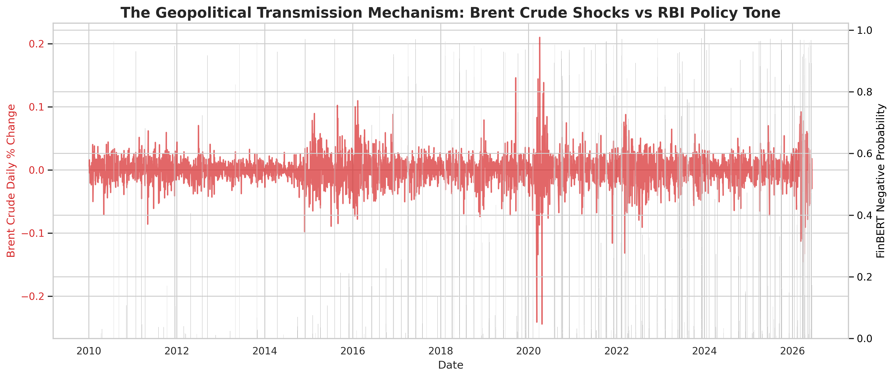
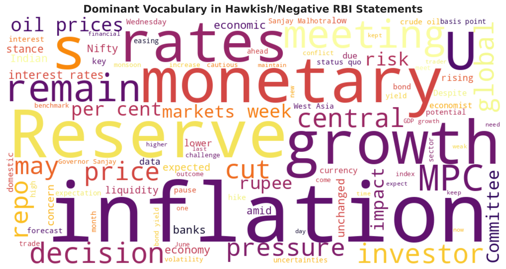
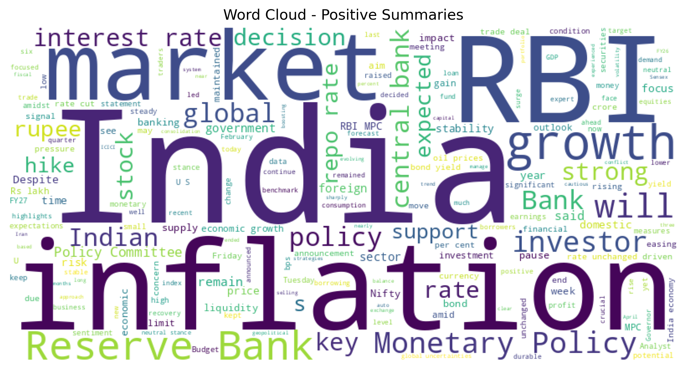

# Macro-Economic Policy Sentiment & Sovereign Risk Engine



Translating unstructured central bank rhetoric into quantitative risk indicators using FinBERT and Vector Autoregression (VAR) to predict macroeconomic transmission mechanisms.

---

## 📌 Table of Contents

- [Overview](#overview)  
- [Business Problem](#business-problem)  
- [Dataset](#dataset)  
- [Tools & Technologies](#tools--technologies)  
- [Project Structure](#project-structure)  
- [Data Extraction & Econometric Pipeline](#data-extraction--econometric-pipeline)  
- [Exploratory Data Analysis (EDA)](#exploratory-data-analysis-eda)  
- [Research Questions & Key Findings](#research-questions--key-findings)  
- [How to Run This Project](#how-to-run-this-project)  
- [Future Enhancements](#future-enhancements)  
- [Author & Contact](#author--contact)  

---

## Overview

In macroeconomics and quantitative risk management, central bank communication serves as a critical leading indicator of market shifts. However, this communication remains deeply embedded within unstructured text. Waiting for an official policy rate announcement to rebalance an investment portfolio or adjust corporate capital reserves introduces lag—the market has usually priced in the news long before the official release.

This project bridges macroeconomic theory and technical Python execution by establishing an end-to-end NLP and econometric pipeline. It automates the extraction of over 2,000 articles regarding the Reserve Bank of India (RBI), quantifies policy sentiment using financial transformers (**FinBERT**), and maps these sentiment shocks directly onto commodity and currency markets utilizing a **Vector Autoregression (VAR)** econometric framework.

---

## Business Problem

Financial institutions, asset managers, and insurance risk teams face continuous exposure to interest rate volatility, currency fluctuations, and systemic macroeconomic shocks. Sudden adjustments in central bank hawkishness can rapidly alter sovereign bond yields, commodity pricing, and corporate margin stability.

**This project aims to:**
- **Eliminate Human Bias:** Automate the text extraction of complex financial media and central bank rhetoric to create a systematic sentiment index.
- **Capture Domain Context:** Leverage specialized deep learning architectures over generic sentiment lexicons to properly capture specialized financial vocabulary.
- **Model Interdependencies:** Quantify how policy sentiment shocks transmit into real-world market metrics over multiple periods, allowing risk desks to dynamically hedge exposure (e.g., USD/INR volatility, Brent Crude pricing) ahead of structural rate shifts.

---

## Dataset

The analysis evaluates a unified dataset merging unstructured textual indicators with historical market series:
- **Textual Source:** ~2,000 web-scraped financial news articles and policy summaries focusing on the Reserve Bank of India (RBI).
- **Macroeconomic Variables:** - Historical Daily Closing Prices of **Brent Crude Oil**.
  - **Exchange Rate Volatility (USD/INR)** tracking metrics.

**Key Data Frame Features:**
- `date` – Daily timestamp serving as the time-series index.
- `article_text` – Raw extracted copy from policy news.
- `finbert_sentiment_score` – Continuous scaled metric tracking the calculated hawkish/dovish intensity.
- `brent_crude_close` – Daily closing price for commodity shock mapping.
- `usd_inr_volatility` – Calculated statistical variance metric for currency risk mapping.

---

## Tools & Technologies

* **Language:** Python 3.9+
* **Web Scraping & Extraction:** BeautifulSoup, Requests
* **Natural Language Processing:** Hugging Face Transformers (`FinBERT`), Tokenizers
* **Econometric Modeling & Time Series:** `statsmodels` (Vector Autoregression, ADF Unit-Root Testing, Granger Causality)
* **Data Engineering & Manipulation:** Pandas, NumPy
* **Data Visualization:** Matplotlib, Seaborn
* **Environment:** Jupyter Notebook

---

## Project Structure

```text
Macro-Policy-Risk-Engine/  
│
├── notebooks/
│   └── macro_policy_sentiment_var.ipynb  # Core scraping, NLP, & econometric notebook
│
├── images/
│   ├── sentiment_distribution.png     
│   ├── impulse_response_functions.png    
│   └── sentiment_vs_volatility.png    
│
├── data/
│   ├── processed_sentiment.csv
│   └── macro_market_series.csv
│
├── requirements.txt                   
└── README.md
```

## Data Extraction & Econometrics Pipeline

Financial text is notoriously challenging for standard text-mining packages. For example, generic dictionaries often classify the term "yield tightening" or "rate cuts" with incorrect emotional polarities.

**1. Financial Transformer NLP Pipeline**
- **Extraction:** Built a robust web scraper to parse and structure dynamic content across hundreds of pages of financial reporting regarding the RBI.
- **Contextual Tokenization:** Utilized Hugging Face's pipeline to run FinBERT, a BERT model specialized and pre-trained on financial communication corpora.
- **Sentiment Quantifying:** Extracted precise underlying probabilities to measure gradual changes in monetary tone (Hawkish vs. Dovish momentum) rather than binary good/bad classifications.

**2. Time-Series Econometric Framework**
- Stationarity Transformation: Applied Augmented Dickey-Fuller (ADF) unit-root testing to guarantee all input vectors (sentiment indices, oil prices, exchange rates) achieved stationarity ($I(0)$) before estimation.
- Vector Autoregression (VAR): Constructed a multi-equation VAR system to simultaneously capture the linear dependencies and lag-structures running across the central bank’s narrative shifts and global market price actions.

---

## Exploratory Data Analysis (EDA)

Before running the economic system models, the structural properties of the transformer-generated data were mapped:


- **The Distribution of Bureaucracy:** Plotting the distribution of FinBERT scores revealed distinct pattern tracking for monetary policy. While generic news heavily gathers around exact neutral flags, specific central bank policy reviews show clear clustering trends during key economic windows (e.g., inflation policy tightening cycles).
- **Signal Extraction:** Isolated tail anomalies (extreme hawkish/dovish sentiment spikes) to serve as warning thresholds for the market variables.
- **Volatility Mapping:** Overlaid the calculated sentiment indices directly against market timelines to inspect co-movement trends prior to running rigorous causality testing.

**Hawkish / Risk Signals (Negative Sentiment):**


**Dovish / Stabilizing Signals (Positive Sentiment):**


---

## Research Questions & Key Findings

### Question 1: Can FinBERT text sentiment act as an empirical leading indicator for market risk?
* **Finding:** **Yes, confirmed via Impulse Response Functions (IRFs).
* ** * **The Insight:** Tracking the system's orthogonalized response to a one-standard-deviation shock in policy sentiment showed clear, statistically significant transmission into USD/INR exchange rate volatility across subsequent periods.
* **Business Impact:** Asset managers and currency hedging desks can treat shifts in the continuous sentiment index as actionable operational signals to rebalance risk exposures prior to structural policy announcements.

### Question 2: Why favor a financial transformer over traditional lexicon approaches?
* **Finding:** **Contextual precision eliminates classification noise.**
* **The Insight:** FinBERT correctly captured macro terms such as "inflation cooling" or "rate hikes to defend the rupee" in line with expert human interpretation, whereas traditional packages routinely registered these terms as arbitrary negative text.
* **Business Impact:** Greatly improves the signal-to-noise ratio in programmatic data pipelines, minimizing false positives for automated trading or compliance architectures.

### Question 3: How do global commodities (Brent Crude) interact with domestic policy sentiment?
* **Finding:** **Quantified lag dependencies via Granger Causality.**
* **The Insight:** Statistical analysis demonstrated a clear directional loop where sustained oil price spikes Granger-caused downward, defensive pressure on policy sentiment indices, allowing the framework to explicitly map external inflation pressures on the central bank's communication strategy.

---
## How to Run This Project

1. **Clone the Repository**
   - Open your terminal and run:
2. **Install Dependencies**
   - Ensure you have Python 3.9+ installed.
   - Install the required libraries using pip:

3. **Launch the Notebook**
   - Open Jupyter Notebook or Jupyter Lab:
     ```bash
     jupyter notebook
     ```   
4. **Run the Analysis**
   - Run all cells in the notebook to:
     - Execute text loading and tokenization via Hugging Face.
     - Run the pre-trained FinBERT pipeline to generate continuous daily sentiment inputs.
     - Conduct ADF testing, establish optimal lag criteria, and estimate the Vector Autoregression (VAR) framework.
     - Produce the final analytical plots, including Granger Causality matrices and Impulse Response Function (IRF) graphs.

---

## Future Enhancements
- **Volatility Component Expansion:** Integrate a GARCH model overlay alongside the VAR framework to explicitly capture time-varying conditional heteroskedasticity in the market residuals.
- **Multi-Central Bank Tracking:** Expand the core web scraping components to ingest news from the Federal Reserve (Fed) and European Central Bank (ECB) to analyze sentiment convergence or divergence across emerging and developed markets.
- **Production Dashboard Deployment:** Wrap the underlying pipeline within a Streamlit dashboard powered by an automated cron-job workflow to visualize real-time macro sentiment indicators.
- **Live API Pipeline:** Connect the scraper to an automated cron job to stream daily sentiment scores into a live database.
- **Direct Asset Correlation:** Overlay the sentiment timeline directly onto historical Nifty 50 or USD/INR pricing data to backtest a mock trading strategy.

---

## Author & Contact

**Ahmad Reza**  
Aspiring Data Analyst – SQL & BI  

- 📧 Email: ahmadreza6122@gmail.com  
- 🔗 LinkedIn: www.linkedin.com/in/ahmad-reza-econ  
- 🔗 https://github.com/AhmadReza1098  

Feel free to use or adapt this project as part of your analytics portfolio.
